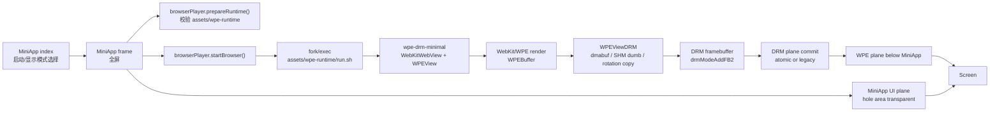

# Direct WPE DRM + MiniApp `<hole>` 展示链路

本文档描述当前 WPE4YDPv2 浏览器的主线渲染架构：MiniApp 只负责生命周期壳和全屏 `<hole>`，WPE/WebKit 作为独立 native 进程直接提交 DRM framebuffer，最终通过 MiniApp 的 hole 区域露出下方 DRM plane。

当前主线不走 MiniApp canvas、RGBFrame、`putImageData`、Cog，也不依赖外部 `/userdisk/wpe-drm2` runtime。WPE runtime 作为普通目录打进 AMR，安装后直接从包内 `assets/wpe-runtime` 运行。

## 1. 总体架构

核心链路：

1. MiniApp `index` 页显示启动入口和显示模式（原生/横屏旋转）选择。
2. 用户点击启动后进入 `frame` 页。
3. `frame` 页只渲染全屏 `<hole>`，同时调用 native JSAPI 启动 WPE。
4. JSAPI `browserPlayer.startBrowser()` fork/exec 包内 `assets/wpe-runtime/run.sh`。
5. `run.sh` 准备 WPE/Mesa/GStreamer/字体/证书环境，再启动 `wpe-drm-minimal`。
6. `wpe-drm-minimal` 创建 WebKit `WebView`，拿到底层 `WPEView`。
7. WebKit/WPE 产出 `WPEBuffer`。
8. `WPEViewDRM` 将 `WPEBuffer` 转换为 DRM framebuffer。
9. `WPEViewDRM` 通过 atomic commit 或 legacy page flip 提交到 DRM plane。
10. MiniApp 上层 plane 的 `<hole>` 区域不绘制自身内容，用户看到下方 WPE DRM plane。



关键代码位置：

- MiniApp frame 页：`src/pages/frame/frame.vue`
- Native JSAPI 启动桥：`jsapi/src/jsapi_browser/JSBrowser.cpp`
- 包内 runtime 启动脚本：`assets/wpe-runtime/run.sh`
- WPE 主程序：`wpe-drm/wpe-drm-minimal.c`
- DRM view / framebuffer / commit：`wpe-drm/WPEViewDRM.cpp`
- DRM connector / crtc / plane 封装：`wpe-drm/WPEDRM.cpp`、`wpe-drm/WPEDRM.h`

## 2. MiniApp 壳层职责

### 2.1 `index` 页

`index` 页是浏览器启动页，不直接显示网页像素，也不参与 WPE 每帧刷新。它只负责：

- 显示“启动浏览器”入口。
- 提供显示模式选项：`原生模式`（跟随系统/MiniApp 框架方向）或 `横屏旋转`（在系统方向基础上旋转到横屏），只影响浏览器画面旋转，传给 WPE/DRM/触摸。
- 进入 `frame` 页，并把 `url/browserMode/returnPage` 作为页面参数传入；`frame` 页再结合系统显示配置解析出实际的 `rotation/panelSize/drmMode`。

`index` 不 import 或调用 `browserPlayer`。native JSAPI 调用只放在 `frame` 页，避免页面切换或旋转别名导致旧 native object 被框架禁用。`index` 也不应该自动进入浏览器；自动启动会让调试和回到 MiniApp 首页时的生命周期变得不可控，也会导致 Home 后重新进入时立刻抢 DRM。

### 2.2 `frame` 页

`frame` 页的模板应保持极简：

```html
<template>
  <div class="frame-page">
    <hole ref="browserHole" class="browser-hole"></hole>
  </div>
</template>
```

对应样式：

```css
.frame-page {
  width: 100vw;
  height: 100vh;
  background-color: #000000;
}

.browser-hole {
  width: 100vw;
  height: 100vh;
}
```

这页的核心职责：

- 渲染全屏 `<hole>`。
- 通过 `$dom.getComponentRect(this.$refs.browserHole)` 读取承载区域尺寸。
- 解析 `panelSize/drmMode/viewport/rotation`。
- 调用 `browserPlayer.prepareRuntime()` 校验包内 runtime。
- 调用 `browserPlayer.startBrowser()` 启动 WPE。
- 维护 watchdog：WPE 异常退出后回到 `index`。
- 在 `onHide/onUnload` 中停止 WPE，释放 DRM。
- 轮询 WPE 的键盘请求文件并调用 HaasUI 系统键盘。

### 2.3 `<hole>` 的作用

`<hole>` 是 MiniApp 合成层的“挖洞”组件。它的语义不是渲染网页，也不是转发 WPE framebuffer，而是让 MiniApp 在该区域不绘制自身 plane 内容。

当前合成预期：

- MiniApp UI plane 在上方。
- WPE DRM plane 在下方。
- `<hole>` 区域透明，露出下方 WPE plane。

如果没有 `<hole>`，`frame` 页的黑色背景会盖住 WPE；如果 WPE plane 的 zpos 高于 MiniApp plane，则 WPE 会直接覆盖 MiniApp，此时即使看得到 WPE，也不能证明 hole 生效。

## 3. JSAPI 启动桥

Native JSAPI 模块名是 `browser`，前端导入：

```js
import { browserPlayer } from 'browser'
```

### 3.1 `prepareRuntime()`

当前 `prepareRuntime({ workspace, dataDir })` 不再把 runtime tar 解压到 `$dataDir`。它做的是：

- 组合包内 runtime 路径：`$workspace/assets/wpe-runtime`
- 校验 runtime 必要文件存在。
- 对可执行文件补 `chmod 755`。
- 清理旧版 `$dataDir` 解压 runtime 残留。
- 返回 runtime 路径给 JS。

关键常量：

```cpp
const char* kRuntimeRelative = "assets/wpe-runtime";
```

`assets/wpe-runtime` 至少应包含：

- `run.sh`
- `wpe-drm-minimal`
- `lib/`
- `libexec/`
- `share/`
- `etc/ssl/certs/ca-certificates.crt`
- `assets/fonts/`
- 调试页面，如 `touch-pointer-test.html`、`raf-test.html`

### 3.2 `startBrowser()` 入参

`frame` 页最终传给 JSAPI 的关键参数：

```js
{
  runtimePath,
  workdir,
  logPath,
  url,
  viewport,
  panelSize,
  drmMode,
  displaySource,
  rotation,
  drm: '/dev/dri/card0',
  useOverlay: true,
  overlayZpos: 0
}
```

含义：

- `runtimePath`：包内 WPE runtime 目录。
- `workdir`：可写工作目录，当前是 `$dataDir/browser/`。
- `logPath`：WPE stdout/stderr 日志路径，通常是 `$dataDir/browser/wpe-drm.log`。
- `url`：启动 URL，默认 `https://m.baidu.com/`。
- `viewport`：WebKit 页面布局尺寸。
- `panelSize`：产品可视屏幕坐标。
- `drmMode`：底层 DRM mode/envelope。
- `displaySource`：本次尺寸解析来源，如 `dom/env/drm_mode/app_config/hard_fallback`。
- `rotation`：WPE 输出旋转角度，支持 `0/90/180/270`。`0` 表示不旋转，`180` 只翻转 WPE DRM 输出和触摸映射，不改变 MiniApp 页面方向。
- `useOverlay`：要求 WPE 使用 overlay plane。
- `overlayZpos`：WPE plane zpos，当前固定 `0`，让它位于 MiniApp 下方。

### 3.3 fork/exec 前设置的环境变量

JSAPI 子进程里会设置：

```sh
WPE_MESA_DIR=$runtimePath
WPE_VAR_DIR=$workdir
WPE_CHROME_STATE=$workdir/browser-state.ini
WPE_CHROME_RENDER_STATE=$workdir/chrome-render-state.ini
WPE_BROWSER_DB=$workdir/browser.sqlite3
WPE_PROFILES_DIR=$workdir/profiles
WPE_PROFILE_SWITCH_FILE=$workdir/profile-switch.request
WPE_CHROME_FONT=$runtimePath/assets/fonts/miniapp/NotoSansSC-Regular.otf
WPE_KEYBOARD_DIR=$workdir/keyboard
WPE_DRM_RUNTIME_DIR=$workdir/runtime-tmp
WPE_DRM_USE_OVERLAY=1
WPE_DRM_ZPOS=0
WPE_PANEL_SIZE=<panelSize>
WPE_VIEWPORT=<viewport>
WPE_DRM_VIEWPORT=<viewport>
WPE_DRM_MODE=<drmMode>
WPE_DISPLAY_SOURCE=<displaySource>
GST_REGISTRY=$workdir/gst-registry.bin
WPE_DEFAULT_URL=<url>
HOME=$workdir
```

`WPE_CHROME_STATE` 和初始 `WPE_DRM_RUNTIME_DIR` 只用于首次升级迁移。DEFAULT
Profile 建立后，主页、标签、历史和收藏写入 `browser.sqlite3`；站点数据与 Cookie
分别写入 `profiles/p<ID>/runtime` 和 `profiles/p<ID>/cookies.sqlite`。Profile
切换由子进程退出码 `75` 驱动，`run.sh` 读取 `profile-switch.request` 后仅重启
`wpe-drm-minimal`，不会结束 MiniApp watchdog 或重载浏览器拥有的 GPU 模块。
Guest 使用 ephemeral NetworkSession，退出后删除临时目录且不会覆盖下次默认 Profile。

然后执行：

```sh
assets/wpe-runtime/run.sh "$url" "/dev/dri/card0" "$viewport" "$rotation"
```

pid 文件写入：

```text
$workdir/browser.pid
```

键盘桥目录：

```text
$workdir/keyboard/requests/
$workdir/keyboard/responses/
```

## 4. Runtime 启动脚本

`assets/wpe-runtime/run.sh` 是 WPE 运行环境入口。它负责把包内 runtime 变成一个可运行的 Linux 用户态环境。

### 4.1 CPU/GPU 渲染档案

默认 `WPE_GPU_MODE=auto`。启动脚本先检查 `/dev/mali0`；节点不存在时，仅在
ARM64 `5.10.160`、模块加载未禁用、KO vermagic 匹配且有 root 权限时，按
`x7_gpu_dt_enable`、`bifrost_kbase` 顺序尝试加载。预先存在的模块不归浏览器
所有，退出时不会卸载；本次加载的模块按相反顺序清理。

GPU 启用前，`libexec/wpe-gpu-probe` 必须确认 ARM/Mali renderer、GLES shader
和 readback、ARGB8888 linear DMA-BUF 导出/映射及 `drmModeAddFB2` 全部成功。
GPU profile 使用包内 `gpu/mali/lib`，通过 `libwpe-mali-gbm-compat.so` 补齐
`gbm_bo_create_with_modifiers2` 和 `gbm_bo_get_fd_for_plane`，但继续使用 runtime
自带的新 `libdrm.so.2`。首帧 12 秒超时或首帧前 WebProcess 崩溃时，`auto`
只重启一次 CPU profile；Home/SIGTERM 不触发回退。

CPU profile 设置：

```sh
LD_LIBRARY_PATH=$MESA/lib:$DIR/lib
LIBGL_DRIVERS_PATH=$MESA/lib/dri
GBM_BACKENDS_PATH=$MESA/lib/gbm
GBM_BACKEND=drm
GALLIUM_DRIVER=softpipe
MESA_LOADER_DRIVER_OVERRIDE=kms_swrast
```

CPU profile 走 Skia CPU + dma-heap/SHM，Mesa softpipe 仅保留兼容依赖；最终出屏
仍走 DRM plane，不经过 MiniApp canvas。`WPE_GPU_MODE=off` 强制 CPU，
`required` 则在任一 GPU 检查失败时退出而不回退。

### 4.2 证书、字体、GStreamer

证书：

```sh
G_TLS_CA_FILE=$DIR/etc/ssl/certs/ca-certificates.crt
SSL_CERT_FILE=$DIR/etc/ssl/certs/ca-certificates.crt
WEBKIT_TLS_CAFILE_PEM=$G_TLS_CA_FILE
```

证书不存在时直接失败，不 silent fallback 到外部 chroot 路径。

字体：

```sh
BUNDLED_FONT_ROOT=$DIR/assets/fonts
FONTCONFIG_CACHE_DIR=$VAR_DIR/fontconfig-cache
FONTCONFIG_FILE=$VAR_DIR/fonts.conf
```

脚本会扫描包内字体并生成 runtime `fonts.conf`。CJK 字体优先来自：

```text
assets/wpe-runtime/assets/fonts/miniapp/
```

GStreamer：

- 私有插件目录：`$DIR/lib/gstreamer-1.0`
- 默认只加载包内插件，日志显示 `gst_source=bundled`。
- 只有显式设置 `WPE_USE_SYSTEM_GST=1` 时，才会把系统插件目录加入 `GST_PLUGIN_PATH`。默认目录是 `/usr/lib/gstreamer-1.0`，也可以用 `WPE_SYSTEM_GST_PLUGIN_DIR` 覆盖。
- 系统 GStreamer 只用于 VPU/ALSA 等硬件能力调试，不是默认运行依赖。
- registry 写入 `$workdir/gst-registry.bin`。

### 4.3 显示与触摸默认值

核心默认值：

```sh
WPE_PANEL_SIZE=${WPE_PANEL_SIZE:-960x266}
WPE_VIEWPORT=${WPE_VIEWPORT:-$WPE_PANEL_SIZE}
WPE_DRM_MODE=${WPE_DRM_MODE:-480x960}
WPE_DRM_FIT=${WPE_DRM_FIT:-panel-native}
WPE_CHROME_LAYOUT=${WPE_CHROME_LAYOUT:-inset}
WPE_RAW_TOUCH=${WPE_RAW_TOUCH:-1}
WPE_TOUCH_DEVICE=<JSAPI 从 cfg.json 解析出的 device.tp>
WPE_TOUCH_NATIVE_SCROLL=${WPE_TOUCH_NATIVE_SCROLL:-1}
WPE_TOUCH_JS_SCROLL=${WPE_TOUCH_JS_SCROLL:-0}
```

输出日志会包含：

```text
WPE launch: url=... drm=... panel=... drm_mode=... viewport=... rotation=... panel_rotation=... touch_rotation=... touch_device=... display_source=... fit=... chrome_layout=... gst_source=...
```

这是排查尺寸和旋转的第一条关键日志。

## 5. 分辨率、DRM mode 和旋转

当前实现必须区分四套尺寸概念。

### 5.1 `panelSize`

`panelSize` 是产品可视坐标，也就是浏览器用户真正看到和触摸的业务坐标。

例子：

- 老设备：`960x266`
- 新设备：`1210x568`

`panelSize` 用于：

- WebKit viewport 归一化。
- WPE 原生 toolbar 坐标。
- 触摸坐标映射。
- 旋转前的 panel-native 画布尺寸。

### 5.2 `drmMode`

`drmMode` 是底层 DRM connector/crtc 暴露的 mode/envelope。

例子：

- 老设备可能暴露 `480x960`
- 新设备可能暴露 `568x1210`

`drmMode` 只用于 DRM commit 层，即 plane 的 CRTC envelope。它不能直接作为网页 viewport。尤其是 `480x960` 这种底层传输坐标，如果参与 WebKit layout，会导致网页变成竖屏布局或画面比例异常。

### 5.3 `viewport`

`viewport` 是 WebKit 页面布局尺寸。当前默认等于 panel-native：

```text
viewport = panelSize
```

WPE 主程序启动后会执行：

- 设置 `WPE_VIEWPORT`
- 设置 `WPE_DRM_VIEWPORT`
- 对底层 `WPEView` 调用 `wpe_view_resized()`
- 使用 `apply_viewport(..., "env")` 应用布局尺寸

默认 `WPE_CHROME_LAYOUT=inset` 时，toolbar 显示/隐藏不会频繁触发 WebKit resize/reflow。`WPE_CHROME_LAYOUT=resize` 只作为调试开关保留，用来对比旧的 WebView 高度重排路径。

### 5.4 framebuffer

framebuffer 是最终提交给 DRM 的 buffer。没有旋转时，通常与 panelSize 一致；旋转 90/270 时，最终 scanout framebuffer 可能是：

```text
panelHeight x panelWidth
```

例子：

```text
panelSize=960x266
rotation=270
framebuffer=266x960
drmMode=480x960
```

这种情况下，`WPEViewDRM` 会把 `960x266` 的源画面旋转复制到 `266x960` 的 dumb framebuffer，然后在 `480x960` 的 DRM envelope 中居中或按 `WPE_DRM_ROTATED_X/WPE_PANEL_CRTC_X` 定位。

### 5.5 `frame` 页解析优先级

`frame` 页启动 WPE 前解析显示配置，优先级是：

1. `<hole>` DOM rect：`$dom.getComponentRect(this.$refs.browserHole)`
2. `$falcon.env.deviceWidth/deviceHeight`
3. full-resolution DRM mode：仅当 DRM mode 看起来像完整面板分辨率，例如短边 >= 540 且长边 >= 1000。
4. `app.json` 中 `browser_display_sku`
5. hard fallback：`960x266` + `480x960` + `270`

如果候选尺寸等于底层 `drmMode`，并且不像完整面板分辨率，会被拒绝，避免 `480x960` 误进网页布局。

成功日志示例：

```text
display_resolve source=dom panel=1210x568 drm_mode=568x1210 viewport=1210x568 rotation=270
```

## 6. WPE 主程序初始化

`wpe-drm-minimal` 启动参数：

```sh
wpe-drm-minimal "$URL" "$DRM" "$VIEWPORT" "$ROTATION"
```

主程序做以下事情：

1. 解析 URL、DRM device、viewport、rotation。
2. 设置缺省 `WPE_PANEL_SIZE/WPE_VIEWPORT/WPE_DRM_FIT/WPE_PANEL_ROTATION`。
3. 创建 `WPEDisplay`：
   ```c
   WPEDisplay *display = wpe_display_drm_new();
   wpe_display_drm_connect(WPE_DISPLAY_DRM(display), drm_device, &error);
   ```
4. 创建 WebKit context/settings/web view。
5. 从 WebKitWebView 获取底层 `WPEView`：
   ```c
   WPEView *wpe_view = webkit_web_view_get_wpe_view(web_view);
   ```
6. 应用 viewport：
   ```c
   apply_viewport(state, viewport_width, viewport_height, "env");
   ```
7. 设置 view 可见和焦点：
   ```c
   wpe_view_set_visible(wpe_view, TRUE);
   wpe_view_focus_in(wpe_view);
   ```
8. 连接 frame 回调：
   ```c
   g_signal_connect(wpe_view, "buffer-rendered", G_CALLBACK(on_buffer_rendered), NULL);
   ```
9. 初始化触摸、键盘、toolbar/chrome。
10. 加载 URL。

关键日志：

```text
WPE DRM Minimal Launcher
Panel: 960x266
Fit: panel-native
Viewport: 960x266
Rotation: 270
Panel rotation: 270
DRM connected: atomic (modifiers/no modifiers)
WPEView mapped: view=... visible=1 mapped=1 focus=1
Frame rendered: ... frame=1 fps=...
```

## 7. WPEBuffer 到 DRM framebuffer

WebKit/WPE 渲染完成后，会给 `WPEViewDRM` 一个 `WPEBuffer`。当前支持两类 buffer。

### 7.1 DMABuf direct path

当 buffer 是 `WPE_BUFFER_DMA_BUF`，且满足：

- 只有一个 plane
- format 是 `DRM_FORMAT_ARGB8888`
- modifier 是 linear 或 invalid 中可接受的直接路径

则可以走直接 scanout：

1. `wpe_buffer_dma_buf_get_fd()` 获取 dma-buf fd。
2. `drmPrimeFDToHandle()` 转成 DRM GEM handle。
3. `drmModeAddFB2()` 创建 framebuffer id。
4. 提交到 DRM plane。

直接路径少一次 CPU 拷贝，是当前优先路径。

### 7.2 SHM dumb-buffer path

当 buffer 是 `WPE_BUFFER_SHM`，且 format 是 `WPE_PIXEL_FORMAT_ARGB8888`，走 dumb buffer fallback：

1. `DRM_IOCTL_MODE_CREATE_DUMB` 创建 scanout buffer。
2. `drmModeAddFB2()` 给 dumb buffer 创建 framebuffer id。
3. `DRM_IOCTL_MODE_MAP_DUMB` 获取 mmap offset。
4. `mmap()` 到用户态地址。
5. 从 WPE SHM `GBytes` 按行拷贝到 dumb buffer。
6. 提交到 DRM plane。

这个路径比 DMABuf 多 CPU 全帧拷贝，但仍然绕过 MiniApp canvas/RGBFrame/JS 合成。

### 7.3 旋转路径

当 `rotation` 是 `90/180/270` 时，当前实现会用 rotated dumb buffer。90/270 会交换最终 scanout framebuffer 宽高；180 不交换宽高，但会在拷贝时翻转像素方向：

- `createRotatedDMABufDumb()`
- `createRotatedSHMDumb()`
- `copyRotatedFromDMABuf()`
- `copyRotatedFromSHM()`

流程：

1. 源 buffer 仍按 WebKit viewport 尺寸产出，例如 `960x266`。
2. 根据 panel 和 rotation 计算目标 framebuffer，例如 `266x960`。
3. 创建目标 dumb buffer。
4. CPU 读取源 buffer，旋转写入目标 dumb buffer。
5. 在目标 dumb buffer 上绘制 native chrome overlay。
6. 提交目标 framebuffer。

### 7.4 Native toolbar/chrome 绘制

WPE 原生工具栏不是 MiniApp UI，也不是网页 DOM。它在 `WPEViewDRM.cpp` 中由轻量软件 raster 画到最终 framebuffer：

```cpp
drawChromeOverlay(...)
```

这一步发生在 DRM commit 前，所以工具栏和网页内容最终是同一个 WPE framebuffer。MiniApp 只负责 `<hole>`，不负责地址栏、tabs、settings 等浏览器 chrome。

当前保留一个性能优先例外：`rotation=0` 且命中 `dma_heap` zero-copy 直扫路径时，buffer 直接进入 DRM commit，不经过 CPU 合成，因此不会绘制 native toolbar。这是预期行为；如果 0 度也需要 toolbar，需要改走 CPU 合成路径或后续实现独立 DRM plane toolbar。

## 8. DRM commit

### 8.1 panel-native fit

默认：

```sh
WPE_DRM_FIT=panel-native
```

目的：

- WebKit 始终按 `panelSize` 布局。
- DRM `mode->hdisplay/vdisplay` 只作为提交 envelope。
- 禁止 `480x960` 这类底层 mode 参与页面比例计算。

`WPEViewDRM` 在 `destinationRectForBuffer()` 中计算：

- `SRC`：framebuffer 全尺寸。
- `CRTC`：DRM envelope 中的位置和大小。

提交日志示例：

```text
WPEViewDRM commit fit=panel-native panel=960x266 drm_mode=480x960 framebuffer=266x960 src=266x960 crtc=266x960+107+0 commit=1
```

这里的 `crtc=...+x+y` 表示 WPE plane 在 DRM mode 坐标里的位置。

### 8.2 Atomic commit

优先使用 atomic：

1. 初次 modeset 创建 mode blob。
2. 设置 CRTC active/mode。
3. 设置 connector crtc id。
4. 设置 plane：
   - `FB_ID`
   - `CRTC_ID`
   - `CRTC_X/Y/W/H`
   - `SRC_X/Y/W/H`
   - `rotation=rotate-0`
   - 可选 `FB_DAMAGE_CLIPS`
   - 可选 `IN_FENCE_FD`
5. `drmModeAtomicCommit()`

当前旋转是在用户态 CPU 拷贝时完成的，提交给 DRM plane 时 plane rotation 仍设置为 rotate-0。

### 8.3 Legacy page flip fallback

如果 atomic 不可用，或通过调试开关禁用，则走 legacy：

- 初次 `drmModeSetCrtc()`
- 后续 `drmModePageFlip()`

legacy 路径能力更弱，不能完整表达 overlay/zpos/多 plane 合成需求，因此主线验收应优先看 atomic 状态。

### 8.4 Buffer 生命周期

page flip 完成后：

- 释放旧 committed buffer。
- 标记新 buffer rendered。
- 调用：
  ```cpp
  wpe_view_buffer_released(...)
  wpe_view_buffer_rendered(...)
  ```

这对 WebKit/WPE 很重要：如果不正确释放 buffer，后续可能出现不再出帧、buffer 堆积、或 page flip 卡死。

## 9. MiniApp `<hole>` 显示 DRM plane

### 9.1 合成模型

当前期望的 plane 层级：

```text
Top:    MiniApp UI plane
        └── frame 页面中 browser-hole 区域透明

Below:  WPE DRM overlay plane
        └── wpe-drm-minimal 提交的 framebuffer

Bottom: 背景 / primary
```

JSAPI 固定传：

```js
useOverlay: true,
overlayZpos: 0
```

对应环境变量：

```sh
WPE_DRM_USE_OVERLAY=1
WPE_DRM_ZPOS=0
```

这样 WPE 尽量使用 MiniApp 下方的 overlay plane。MiniApp 在全屏 `<hole>` 区域不绘制，屏幕最终看到 WPE。

### 9.2 为什么不是 MiniApp 刷网页像素

旧思路是 WPE 渲染成 buffer，再拷贝给 MiniApp `ImageData`，最后 JS `putImageData()`。这条路有几层额外成本：

- native -> JSAPI buffer 同步
- JS 对象/ArrayBuffer/ImageData 生命周期
- MiniApp canvas 合成
- 每帧 JS 调度

当前路径是：

```text
WebKit/WPE -> WPEBuffer -> DRM framebuffer -> DRM plane -> screen
```

MiniApp 只作为生命周期宿主，不参与每帧刷新。

### 9.3 capture 的限制

`miniapp_cli capture` 可能只抓 MiniApp 自己的 UI plane。因为 WPE 在另一个 DRM plane 上，capture 看到黑图并不一定表示 WPE 没有出屏。

判断 WPE 是否工作要同时看：

- 肉眼屏幕显示。
- WPE 进程是否存在。
- `$dataDir/browser/wpe-drm.log` 是否持续出 `Frame rendered`。
- `/sys/kernel/debug/dri/0/state` 是否同时有 MiniApp plane 和 WPE plane。
- WPE plane 的 `fb`、`crtc-pos`、`zpos` 是否合理。

## 10. 输入、滚动与键盘

### 10.1 触摸

WPE 直接读取触摸设备：

```sh
WPE_RAW_TOUCH=1
WPE_TOUCH_DEVICE=/dev/input/by-path/hyn_ts
```

触摸坐标按 panel-native 坐标处理，并结合 `WPE_PANEL_ROTATION` 做映射。重点原则：

- 触摸不映射到 `drmMode`。
- 触摸不映射到 `480x960` 这类底层传输坐标。
- toolbar 区域由 WPE chrome hit-test 消费。
- 网页区扣除 toolbar inset 后转发给 WebKit。

### 10.2 滚动

默认：

```sh
WPE_TOUCH_NATIVE_SCROLL=1
WPE_TOUCH_JS_SCROLL=0
```

也就是说滚动优先发 WPE/WebKit native scroll event，不再用高频：

```js
webkit_web_view_evaluate_javascript("elementFromPoint/getComputedStyle/scrollBy...")
```

JS scroll fallback 只应该作为调试开关，不能作为默认滚动路径，否则复杂页面会压住 WebProcess 主线程，造成滑动后低帧率或卡死。

### 10.3 系统键盘桥

WPE 不能直接调用 HaasUI 系统输入法，所以用文件桥交给 MiniApp。

请求目录：

```text
$workdir/keyboard/requests/
```

响应目录：

```text
$workdir/keyboard/responses/
```

终态目录：

```text
$workdir/keyboard/status/
```

流程：

1. WPE 发现输入触发点。
2. WPE 写入请求 JSON：
   ```text
   $workdir/keyboard/requests/current.json
   ```
   请求 `id` 写在 JSON 内。固定文件名可以让 JSAPI 先 `stat` 再读取，避免每轮 `opendir/readdir`。
3. MiniApp `frame` 页每 200ms 轮询 `browserPlayer.pollKeyboardRequest()`。
4. MiniApp 根据 `$workdir/keyboard/backend.json` 选择已验证后端；未知设备先探测
   `<textarea softInputEnable>`，1.5 秒内没有键盘切前后台、输入或确认事件时，关闭
   textarea 后再单独调用 `global.startTextEdit()`。两个入口不会同时打开。
5. textarea 后端会持续把完整当前文本和单调递增的 `sequence` 原子写入：
   ```text
   $workdir/keyboard/responses/<id>.update
   ```
   `.update` 是增量状态文件，不做 `fsync`。
6. 用户确认或取消。
7. MiniApp 调用 `browserPlayer.respondKeyboardRequest()` 写入最终响应：
   ```text
   $workdir/keyboard/responses/<id>.ok
   $workdir/keyboard/responses/<id>.cancel
   ```
8. 网页 frame 通过 `script-message-with-reply-received` 保持异步 waiter。WPE 把
   update/commit 回复到真正发起请求的 frame，iframe 自己写入目标并在下一帧验证，
   不再从主 frame 调用 `evaluate_javascript()` 查找输入框。
9. WPE 删除自己创建的 `requests/current.json`，并用临时文件、`fsync`、`rename`
   原子发布 `status/<id>.json`。`pollKeyboardCompletion()` 是非破坏读取；MiniApp
   成功解析后调用 `ackKeyboardCompletion()` 删除终态。
10. 地址栏输入在最终 `.ok` 后才跳转；textarea 网页输入对 `.update` 实时写入，
    global-only 设备在最终确认时一次写入，最终 commit 再派发 `change`。

网页键盘请求只由可信触摸点击触发，不监听 `focusin` 自动弹出。同一 request ID 在 MiniApp 中只允许进入一次 `opening -> active -> responding` 流程，重复的 `input/textChanged`、过期 UUID 和重复终态回调都必须忽略。

`app.json` 的 `keyboard_backend` 可设为 `auto`、`textarea` 或 `global`。默认
`auto`；人工值只用于现场调试，不进入浏览器设置 UI。

## 11. 常用调试命令

以下命令默认 appid 是 `8001779591038449`。

### 11.1 查看 WPE 进程

```sh
adb shell 'pidof wpe-drm-minimal WPEWebProcess WPENetworkProcess WPEGPUProcess 2>/dev/null || true'
```

### 11.2 查看 WPE 进程环境变量

```sh
adb shell '
PID=$(pidof wpe-drm-minimal 2>/dev/null | awk "{print \$1}")
echo pid=$PID
if [ -n "$PID" ]; then
  tr "\0" "\n" </proc/$PID/environ | grep -E "WPE_(PANEL_SIZE|VIEWPORT|DRM_VIEWPORT|DRM_MODE|DISPLAY_SOURCE|PANEL_ROTATION|DRM_ROTATION|DRM_USE_OVERLAY|DRM_ZPOS)" | sort
fi
'
```

### 11.3 查看 WPE 日志

```sh
adb shell '
LOG=/userdisk/secondary/miniapp/data/mini_app/pkg/8001779591038449/data/browser/wpe-drm.log
tail -n 160 "$LOG" 2>/dev/null || true
'
```

### 11.4 过滤关键成功日志

```sh
adb shell '
LOG=/userdisk/secondary/miniapp/data/mini_app/pkg/8001779591038449/data/browser/wpe-drm.log
grep -E "display_resolve|WPE launch|Panel:|Viewport:|WPE DRM toplevel sizing|WPEViewDRM commit|Frame rendered|Load changed|Load failed" "$LOG" | tail -120
'
```

### 11.5 查看 DRM state

```sh
adb shell 'sed -n "1,180p" /sys/kernel/debug/dri/0/state'
```

重点看：

- connector mode：底层 `drmMode`
- plane 是否有多个：MiniApp plane + WPE plane
- WPE plane 的 `fb`
- WPE plane 的 `crtc-pos`
- WPE plane 的 `src`
- WPE plane 的 `zpos`

### 11.6 确认 runtime 来自包内

```sh
adb shell '
PID=$(pidof wpe-drm-minimal 2>/dev/null | awk "{print \$1}")
if [ -n "$PID" ]; then
  tr "\0" "\n" </proc/$PID/cmdline
  echo
  grep -E "assets/wpe-runtime|libWPEWebKit|libEGL|libGLES|libgbm|fonts|ssl" /proc/$PID/maps | head -80
fi
'
```

期望看到路径类似：

```text
/userdisk/secondary/miniapp/data/mini_app/pkg/8001779591038449/.../assets/wpe-runtime/run.sh
/assets/wpe-runtime/lib/libWPEWebKit-2.0.so...
/assets/wpe-runtime/etc/ssl/certs/ca-certificates.crt
/assets/wpe-runtime/assets/fonts/...
```

不应该依赖：

```text
/userdisk/wpe-drm2
/userdisk/mesa
/userdisk/chroot/rootfs/debian-12-arm64/opt/wpe-hostabi
```

### 11.7 清理残留 WPE

```sh
adb shell '
for p in $(pidof WPEWebProcess WPENetworkProcess WPEGPUProcess wpe-drm-minimal 2>/dev/null); do
  kill -TERM "$p" 2>/dev/null || true
done
sleep 1
for p in $(pidof WPEWebProcess WPENetworkProcess WPEGPUProcess wpe-drm-minimal 2>/dev/null); do
  kill -KILL "$p" 2>/dev/null || true
done
'
```

### 11.8 保持屏幕亮起

```sh
adb shell 'hal-screen on; hal-screen keep'
```

## 12. 成功验收标准

启动后应满足：

1. MiniApp `index` 不自动启动 WPE。
2. 点击启动后进入 `frame`。
3. `frame` 页面全屏 `<hole>`。
4. WPE 进程存在：
   ```text
   wpe-drm-minimal
   WPEWebProcess
   WPENetworkProcess
   ```
5. 日志显示：
   ```text
   display_resolve source=... panel=... drm_mode=... viewport=... rotation=...
   WPE launch: ... panel=... drm_mode=... viewport=... rotation=...
   Panel: ...
   Viewport: ...
   WPEViewDRM commit fit=panel-native ...
   Frame rendered: ...
   ```
6. `/sys/kernel/debug/dri/0/state` 中能看到 WPE plane。
7. 肉眼可见网页。
8. 页面可滚动，toolbar 可显示/隐藏。
9. 点击地址栏或网页输入框可通过 MiniApp 系统键盘输入。
10. Home 退出后 WPE 停止，重新进入后可重新启动。

## 13. 常见故障与定位

### 13.1 hole 区域黑屏

可能原因：

- WPE 没有启动。
- WPE 已启动但没有成功 commit DRM。
- WPE plane 被 MiniApp 黑页盖住。
- WPE plane zpos 高/低关系不符合预期。
- `miniapp_cli capture` 只抓 MiniApp plane，误判为黑屏。

定位：

```sh
adb shell 'pidof wpe-drm-minimal WPEWebProcess WPENetworkProcess 2>/dev/null || true'
adb shell 'tail -n 120 /userdisk/secondary/miniapp/data/mini_app/pkg/8001779591038449/data/browser/wpe-drm.log'
adb shell 'sed -n "1,180p" /sys/kernel/debug/dri/0/state'
```

### 13.2 `480x960` 误进网页 viewport

表现：

- 百度/Bing 变成竖屏布局。
- 页面被拉伸或缩成细条。
- 日志里 `Viewport: 480x960` 或 `display_resolve panel=480x960`。

修复方向：

- 检查 `frame` 页尺寸解析是否拒绝了底层 `drmMode`。
- 检查 `$dom.getComponentRect()` 是否返回了真实 full-screen hole 尺寸。
- 检查 `app.json` `browser_display_sku` fallback。

### 13.3 WPE plane zpos 不对

表现：

- 不用 `<hole>` 也能看到 WPE，说明 WPE 可能盖在 MiniApp 上方。
- 使用 `<hole>` 后看不到 WPE，说明 WPE 可能没有在 hole 下方或没有 commit。

检查：

```sh
adb shell 'tr "\0" "\n" </proc/$(pidof wpe-drm-minimal | awk "{print \$1}")/environ | grep WPE_DRM_ZPOS'
adb shell 'sed -n "1,220p" /sys/kernel/debug/dri/0/state | grep -E "plane|zpos|fb|crtc-pos"'
```

### 13.4 DRM master 或 plane 被占用

表现：

- `wpe-drm-minimal` 启动失败。
- 日志中 DRM connect/commit 失败。
- WPE 无法拿到 plane 或 page flip 失败。

处理：

- 先停止残留 WPE。
- 确认 MiniApp frame 生命周期正常释放。
- 检查是否有其它 DRM 程序占用。

### 13.5 `unsupported buffer`

表现：

```text
Failed to render buffer: unsupported buffer
```

可能原因：

- WebKit 输出的 buffer 类型不是当前支持的 DMABuf/SHM。
- DMABuf format/plane/modifier 不满足 direct path。
- SHM format 不是 ARGB8888。

处理：

- 查看前后日志确认 buffer path。
- 临时打开 SHM fallback 调试。
- 检查 runtime 中 Mesa/EGL/GBM 配置是否改变。

### 13.6 中文字体显示方块

表现：

- 中文变成口口口。

定位：

- 查看 `run.sh` 日志：
  ```text
  WPE fonts: root=... cjk=...
  ```
- 确认包内有：
  ```text
  assets/wpe-runtime/assets/fonts/miniapp/NotoSansSC-Regular.otf
  ```
- 确认 `FONTCONFIG_FILE` 指向 `$workdir/fonts.conf`。

### 13.7 HTTPS 证书错误

表现：

- 页面 TLS 失败。
- 日志提示证书无法接受。

定位：

- 确认包内存在：
  ```text
  assets/wpe-runtime/etc/ssl/certs/ca-certificates.crt
  ```
- 查看环境变量：
  ```sh
  G_TLS_CA_FILE
  SSL_CERT_FILE
  WEBKIT_TLS_CAFILE_PEM
  ```

当前策略是：证书文件缺失则直接报错，不 fallback 到 chroot 路径；证书存在时不应该无条件 ignore TLS。

### 13.8 capture 黑图但肉眼可见

这是正常可能性。`miniapp_cli capture` 可能只抓 MiniApp UI plane，而 WPE 是独立 DRM plane。

判断标准应以：

- 肉眼屏幕
- DRM state
- WPE frame log
- WPE 进程 maps

为准。

## 14. 一次完整验证流程

```sh
# 1. 清理残留
adb shell '
for p in $(pidof WPEWebProcess WPENetworkProcess WPEGPUProcess wpe-drm-minimal 2>/dev/null); do
  kill -TERM "$p" 2>/dev/null || true
done
sleep 1
for p in $(pidof WPEWebProcess WPENetworkProcess WPEGPUProcess wpe-drm-minimal 2>/dev/null); do
  kill -KILL "$p" 2>/dev/null || true
done
'

# 2. 启动 MiniApp index
adb shell 'miniapp_cli start 8001779591038449 --index'

# 3. 确认没有自动启动 WPE
adb shell 'pidof wpe-drm-minimal WPEWebProcess WPENetworkProcess 2>/dev/null || true'

# 4. 在设备上点击启动浏览器

# 5. 查看进程
adb shell 'pidof wpe-drm-minimal WPEWebProcess WPENetworkProcess 2>/dev/null || true'

# 6. 查看日志
adb shell '
LOG=/userdisk/secondary/miniapp/data/mini_app/pkg/8001779591038449/data/browser/wpe-drm.log
grep -E "WPE launch|Panel:|Viewport:|WPEViewDRM commit|Frame rendered|Load changed|Load failed" "$LOG" | tail -120
'

# 7. 查看 DRM state
adb shell 'sed -n "1,220p" /sys/kernel/debug/dri/0/state'
```

## 15. 当前设计边界

- MiniApp 不参与网页像素刷新。
- MiniApp 不绘制浏览器 toolbar。
- WPE native chrome 负责地址栏、Profile、tabs、history、bookmarks、settings。
- WPE 直接处理触摸和滚动。
- 系统键盘必须通过 MiniApp 桥接。
- Runtime 本体必须随 AMR 内置，不能依赖 `/userdisk/wpe-drm2`、`/userdisk/mesa`、chroot runtime。
- Mali 专有库和设备 KO 仅由本地 staging 加入 AMR，不进入公开 Git；缺失时 `auto` 必须仍能正常启动 CPU profile。
- `$dataDir/browser` 只用于可写状态、日志、pid、Profile 数据库/站点数据、缓存和键盘请求。

## 16. WebRTC 云游戏与完整帧诊断

WebRTC 默认由包内 GStreamer backend 提供，`WPE_WEBRTC=1`，本地采集固定为
`WPE_WEBRTC_CAPTURE=deny`。远端 H.264 应由 `mppvideodec` 解码；得到 NV12
DMA-BUF 后，hole-punch sink 通过 unix socket 交给 UI 进程并提交到独立 Esmart
视频 plane。云原神主机在 `WPE_INPUT_PROFILE=auto` 下使用 `game`，raw touch 的
down/move/up 按 slot 原样发给 WebKit，不生成浏览器 scroll 或 synthetic tap。
云游戏视频进入 `playing` 后，`WPE_GAME_MEDIA_IMMERSIVE=1` 会自动隐藏 native
toolbar；此时顶部热区仍可手动唤回 toolbar。网页随后通过 Fullscreen API
进入严格全屏时，launcher 会关闭 toolbar 和所有顶部唤出热区；退出全屏后恢复
toolbar。
视频采用 `WPE_VIDEO_OVERLAY_FIT=contain` 时，WPEViewDRM 会发布可见视频矩形。
只有落在该矩形内的 panel-native 触摸才反算到 DOM 视频坐标；留黑区域和网页
覆盖控件保持原始坐标，避免全屏按钮被夹到游戏画面边缘。raw 坐标边界固定映射
到 `0..width-1`、`0..height-1`。

基础链路测试：

```sh
# 地址栏打开包内 assets/wpe-runtime/tests/webrtc-loopback.html 后
adb shell 'grep -E "WEBRTC_TEST|PASS ICE|Denied local" \
  /userdisk/secondary/miniapp/data/mini_app/pkg/8001779591038449/data/browser/wpe-drm.log | tail -80'

# 云游戏开始推流后验证硬解和视频 plane
adb shell 'grep -E "mppvideodec|hole-punch|video overlay" \
  /userdisk/secondary/miniapp/data/mini_app/pkg/8001779591038449/data/browser/wpe-drm.log | tail -80'
adb shell 'grep -E "plane\[|format=NV12|fb=|crtc-pos=" /sys/kernel/debug/dri/0/state'
```

旋转或CPU合成路径读取DMA-BUF前会等待WPE rendering fence，并在读取区间执行
`DMA_BUF_IOCTL_SYNC`。`WPE_DRM_PARTIAL_COPY=0`默认强制完整帧复制；fence超时会
丢弃未完成帧并保留上一张完整画面。每60帧的日志应检查
`fence_timeouts=0`、`full_copies`持续增长且`partial_copies=0`。
